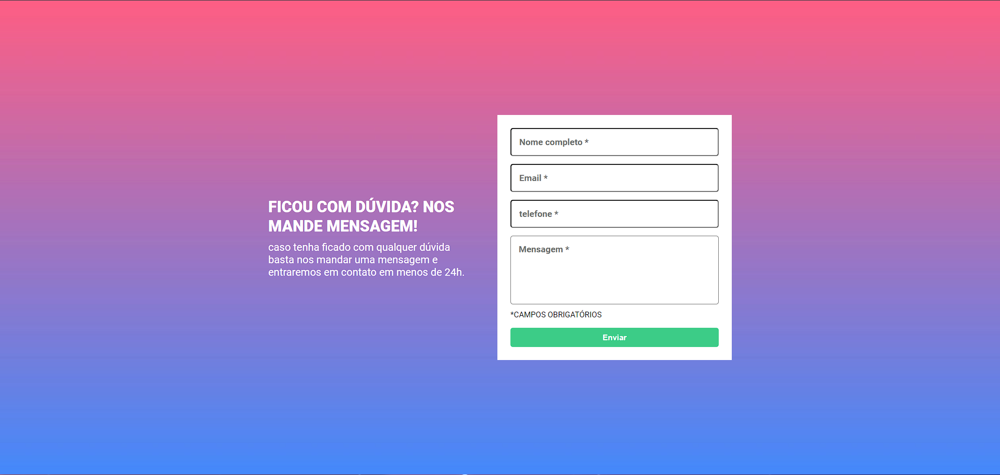
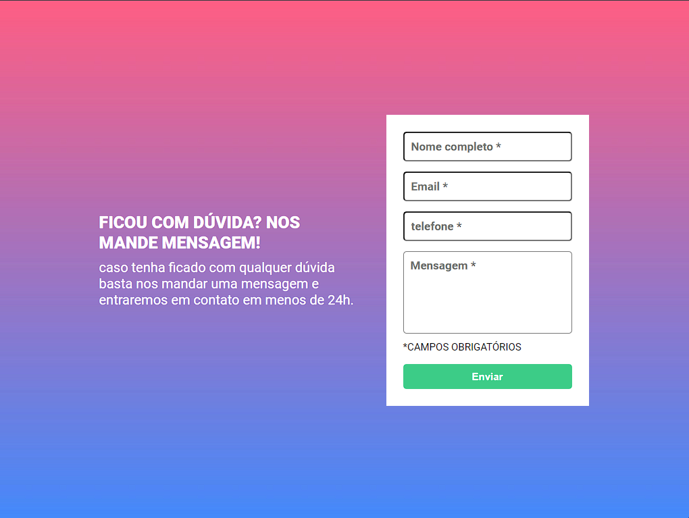
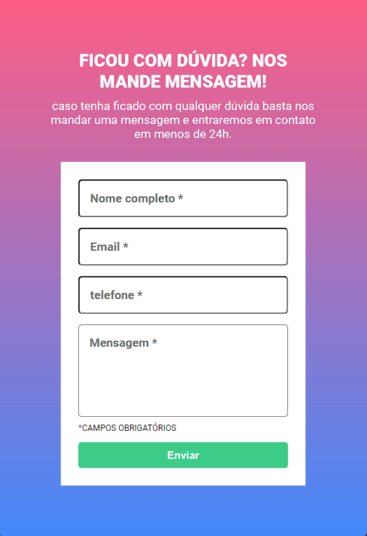

# desafio-html-css-js-intermediário

Este é um projeto da DevQuest Dev em Dobro que consiste em construir um formulário usando HTML, CSS e JavaScript. 🚀

## Objetivo

O objetivo deste projeto é praticar as habilidades de desenvolvimento web front-end, seguindo o design fornecido pelo Figma e implementando a validação do formulário no lado do cliente. 🎯

## Funcionalidades

Os usuários devem ser capazes de:

- Ver o layout otimizado para o site dependendo do tamanho da tela do dispositivo 📱
- Receber uma mensagem de erro quando o formulário for enviado se: ❌
  - Qualquer campo de entrada estiver vazio. A mensagem para este erro deve dizer "campo obrigatório"
- Mostrar a borda vermelha se o usuario não colocou todas as informaçoes necessarias.
- Mostrar a borda verde se o usuario colocou todas as informaçoes.

## Tecnologias utilizadas

- HTML 📄
- CSS 🎨
- JavaScript 🛠️

## Como executar

Para executar este projeto localmente, você pode clonar o repositório do GitHub e abrir o arquivo index.html no seu navegador. 💻

## Demonstração

Você pode ver uma demonstração deste projeto no seguinte link: [Veja o projeto](https://desafio-html-css-js-intermediario.vercel.app/) 🌐

 

